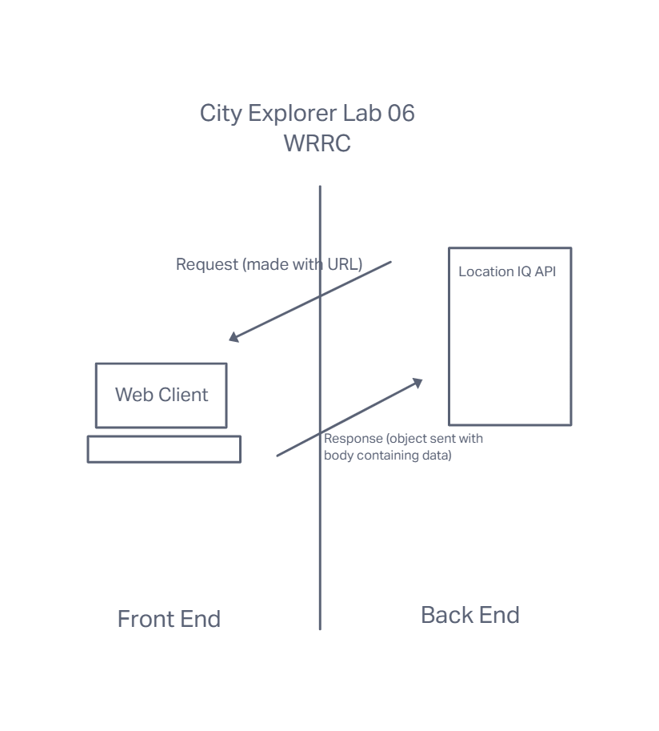

# Lab - Class 06 - Asynchronous code, and APIs

**Author**: Rey Mercado
**Version**: 1.0.0 (increment the patch/fix version number if you make more commits past your first submission)

## Overview

Today I will be building a React application that uses the Axios library to make user-initiated reqeusts for data from a thrid-party API.

Convert the `README.md` file to be documentation regarding your lab and its current state of development. Check the "documentation" section of the lab assignment for more details on how that should look AT MINIMUM.

<!-- Provide a high level overview of what this application is and why you are building it, beyond the fact that it's an assignment for this class. (i.e. What's your problem domain?) -->

Provide a high level overview of what this application is and why you are building it, beyond the fact that it's an assignment for this class. (i.e. What's your problem domain?)

## Getting Started
<!-- What are the steps that a user must take in order to build this app on their own machine and get it running? -->

What are the steps that a user must take in order to build this app on their own machine and get it running?

## Process

For every lab in this module, you will have a new partner. For this lab, you and your new partner(s) will spend the first 15 minutes planning out an approach to this lab’s work on a whiteboard.

## Draw the web request-response cycle for the current lab tasks (about 15 minutes).

Document the data flow: identify inputs and outputs for each part of the cycle.
Outline the functions that support this data flow.
Be sure to include these drawings in your README.md.
You will then work independently for the rest of the day, implementing your plan, coding in your own repository, submitting your own pull request.

## Whiteboard visualization / group work

Drawing collaborated with group partner Liesl White

## Netlify App URL

(https://gallant-engelbart-d8b680.netlify.app/)

## Trello board url

(https://trello.com/b/xGlz6ikd/city-explorer-301d82)

## Architecture

Provide a detailed description of the application design. What technologies (languages, libraries, etc) you're using, and any other relevant design information.
<!-- Provide a detailed description of the application design. What technologies (languages, libraries, etc) you're using, and any other relevant design information. -->

## Change Log

Use this area to document the iterative changes made to your application as each feature is successfully implemented. Use time stamps. Here's an example:

01-01-2001 4:59pm - Application now has a fully-functional express server, with a GET route for the location resource.

<!-- Use this area to document the iterative changes made to your application as each feature is successfully implemented. Use time stamps. Here's an example:

01-01-2001 4:59pm - Application now has a fully-functional express server, with a GET route for the location resource. -->

## Credit and Collaborations
<!-- Give credit (and a link) to other people or resources that helped you build this application. -->
Time Estimates
For each of the lab features, make an estimate of the time it will take you to complete the feature, and record your start and finish times for that feature:

Name of feature: ________________________________

Estimate of time needed to complete: _____

Start time: _____

Finish time: _____

Actual time needed to complete: _____

Name of feature: Set up your React repository and API keys_____________- card1___________________

Estimate of time needed to complete: _2 hours____

Start time: 2:20pm_____

Finish time: 6:46pm_____

Actual time needed to complete: _4 hours 25 min____

Name of feature: card2 feat 1 - build a form
  card2 Locations:As a user of City Explorer, I want to enter the name of a location so that I can see the exact latitude and longitude of that location. - 
  feat 1: Build a form to collect a city name from the user. Give the submit button the text of "Explore!"

Estimate of time needed to complete: 1hr_____

Start time: ___7pm__

Finish time: __8pm___

Actual time needed to complete: __1hr___

Name of feature: card2 feat 2 - lat long
  card2 As a user of City Explorer, I want to enter the name of a location so that I can see the exact latitude and longitude of that location. 
  feat 2 - Use the data from the form to query LocationIQ for the latitude and longitude of the requested city.

Estimate of time needed to complete: __1hour___

Start time: ___8pm__

Break time: ____1150pm_
Continue time: ___1155pm_
Break time: 1230am Feb 22
Continue time: 745am Feb 22
Finish time: ____758am Feb 22_

Actual time needed to complete: __4.75 hours about___

Name of feature: _card2feat3 - render lat long to page
_Update the page with the returned `display_name`, `latitude`, and `longitude`, displayed nicely in an appropriate Bootstrap component. ______________________________

Estimate of time needed to complete: 10min____

Start time: _758am feb22____

Finish time: 828am_____

Actual time needed to complete: _30min____

# Getting Started with Create React App

This project was bootstrapped with [Create React App](https://github.com/facebook/create-react-app).

## Available Scripts

In the project directory, you can run:

### `npm start`

Runs the app in the development mode.\
Open [http://localhost:3000](http://localhost:3000) to view it in your browser.

The page will reload when you make changes.\
You may also see any lint errors in the console.

### `npm test`

Launches the test runner in the interactive watch mode.\
See the section about [running tests](https://facebook.github.io/create-react-app/docs/running-tests) for more information.

### `npm run build`

Builds the app for production to the `build` folder.\
It correctly bundles React in production mode and optimizes the build for the best performance.

The build is minified and the filenames include the hashes.\
Your app is ready to be deployed!

See the section about [deployment](https://facebook.github.io/create-react-app/docs/deployment) for more information.

### `npm run eject`

**Note: this is a one-way operation. Once you `eject`, you can't go back!**

If you aren't satisfied with the build tool and configuration choices, you can `eject` at any time. This command will remove the single build dependency from your project.

Instead, it will copy all the configuration files and the transitive dependencies (webpack, Babel, ESLint, etc) right into your project so you have full control over them. All of the commands except `eject` will still work, but they will point to the copied scripts so you can tweak them. At this point you're on your own.

You don't have to ever use `eject`. The curated feature set is suitable for small and middle deployments, and you shouldn't feel obligated to use this feature. However we understand that this tool wouldn't be useful if you couldn't customize it when you are ready for it.

## Learn More

You can learn more in the [Create React App documentation](https://facebook.github.io/create-react-app/docs/getting-started).

To learn React, check out the [React documentation](https://reactjs.org/).

### Code Splitting

This section has moved here: [https://facebook.github.io/create-react-app/docs/code-splitting](https://facebook.github.io/create-react-app/docs/code-splitting)

### Analyzing the Bundle Size

This section has moved here: [https://facebook.github.io/create-react-app/docs/analyzing-the-bundle-size](https://facebook.github.io/create-react-app/docs/analyzing-the-bundle-size)

### Making a Progressive Web App

This section has moved here: [https://facebook.github.io/create-react-app/docs/making-a-progressive-web-app](https://facebook.github.io/create-react-app/docs/making-a-progressive-web-app)

### Advanced Configuration

This section has moved here: [https://facebook.github.io/create-react-app/docs/advanced-configuration](https://facebook.github.io/create-react-app/docs/advanced-configuration)

### Deployment

This section has moved here: [https://facebook.github.io/create-react-app/docs/deployment](https://facebook.github.io/create-react-app/docs/deployment)

### `npm run build` fails to minify

This section has moved here: [https://facebook.github.io/create-react-app/docs/troubleshooting#npm-run-build-fails-to-minify](https://facebook.github.io/create-react-app/docs/troubleshooting#npm-run-build-fails-to-minify)
